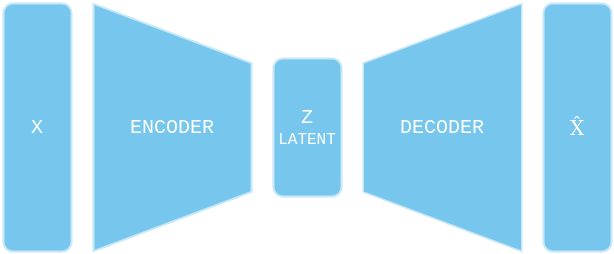
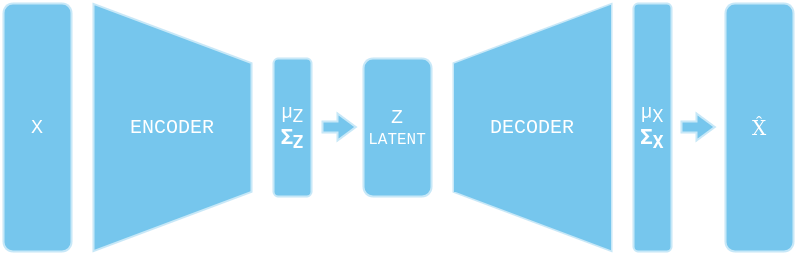
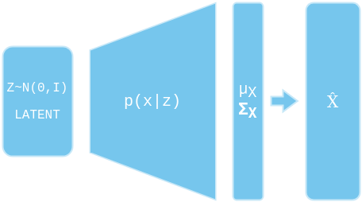
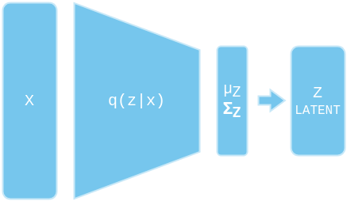
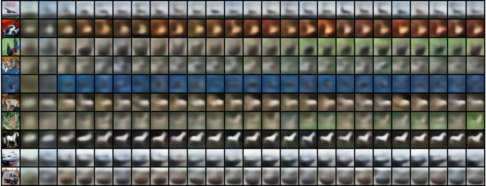
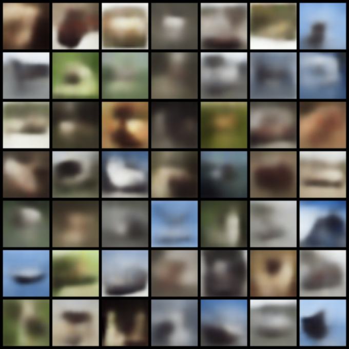

# VARIATIONAL AUTOENCODERS

Variational Autoencoders were first described in the paper:
 * "Auto-encoding variational Bayes" by Kingma and Welling,
 ([here](https://arxiv.org/abs/1312.6114))

A great tutorial on the Variational Autoencoder can be found in the paper:
 * "Tutorial on Variational Autoencoders" by Carl Doersch,
 ([here](https://arxiv.org/abs/1606.05908))

The equation that is at the core of the variational autoencoder is:

```math
\log p(x) - KL(q(z|x) || p(z|x)) = \mathbb{E}_{z \sim q(x)} \space \log p(x|z) - KL(q(z|x) || P_Z(z)).
```

The left hand side has the quantity that we want to optimize: $\log p(x)$. And
the right hand side is the so called Evidence Lower Bound (ELBO). Note that
the *KL* divergence between $q(z|x)$ and $p(z|x)$ cannot be computed. However,
the *KL* divergence is always non-negative, so the right-hand side is actually
a lower bound for $\log p(x)$, and optimizing this lower bound should yield
improved performance. Note that the optimal solution for the ELBO is actually
$q(z|x) = p(z|x)$, and assuming we use a high capacity model for $q(z|x)$ that
will hopefully match $p(z|x)$, then the bound is actually tight.


### AUTOENCODERS VS VARIATIONAL AUTOENCODERS

Autoencoders are trained to encode input data into a smaller feature vector,
and afterwards reconstruct it into the original input. In general, an autoencoder
consists of an encoder that maps the input $x$ into a lower-dimensional latent
vector $z$, and a decoder that reconstructs the input $\hat{x}$ from $z$. The
autoencoder creates a bottleneck that ensures only the main structured part of
the information can go through and be reconstructed. The model is trained by
comparing $x$ to $\hat{x}$ by simply computing the mean squared error.

Suppose that both the encoder and decoder architectures have only one hidden
layer without any non-linearity (linear autoencoder). In this case we can see a
clear connection with *PCA*, in the sense that we are looking for the best linear
subspace to project the data on. In general, both the encoder and the decoder
are deep non-linear networks, and thus inputs are encoded into a much more
complex subspace.



Once we have a trained autoencoder we can use the encoder to "compress" inputs
from our high-dimensional input space into the low-dimensional latent space. And
we can also use the decoder to decompress them back into the high-dimensional
input space. But there is no convenient way to generate any new data points from
our input space. In order to generate a new data point we need to sample a
feature vector from the latent space and decode it afterwards. However there is
no convenient way to choose "good" samples from our latent space. To solve this
problem, variational autoencoders introduce a new idea for compression. Instead
of encoding the input as a single feature vector, the variational autoencoder
will encode the input as a probability distribution over tha latent space. In
practice, the encoded distribution is chosen to be a multivariate normal
distribution with a diagonal covariance matrix. Thus, the output of the encoder
component will be a vector of ($\mu_Z$, $\sigma_Z$) pairs, instead of single
numbers. The actual encoding $Z$ is produced by sampling from the distribution
produced by the encoder. Finally, in order to generate a data point from the
encoding $Z$ the decoder will also produce a probability distribution from which
we need to sample.




### DEFINING THE OBJECTIVE

The mathematics behind Variational Autoencoders actually has very little to do
with classical autoencoders. They are called *"autoencoders"* only because the
architecture does have an encoder and a decoder and *resembles* a traditional
autoencoder.

First of all, what we want to achieve is to produce a model that can generate
data points from the space of our training data. To do this we will assume that
there is some latent space $\mathcal{Z}$ with underlying distribution $p_Z(z)$
and a function $p_\theta(x|z)$ that takes as input $z$ and produces the
parameters to the probability distribution of the data point $x$. For example,
a Gaussian parametrized by $\mu$ and $\sigma$:

```math
p_\theta(x|z) = \mathcal{N} (\mu_\theta(z), \sigma_\theta(z)).
```

The marginal probability of $x$ is given by:

```math
p_\theta(x) = \sum_\mathcal{Z} p_\theta(x | z) p_Z(z).
```

and our objective is to maximize the likelihood of the training data:

```math
\max_\theta \mathbb{E}_{x} \space [\log p_\theta(x)].
```

Using this approach we expect the model to learn to decode nearby latents to
similar things.



If we choose the latent space $\mathcal{Z}$ to be finite (e.g. manually engineer
it), then we could compute the objective exactly. For some data point $x$ from
our training set we will compute the marginal probability $p_\theta(x)$ by
summing over the latent space, and then we will optimize the parameters $\theta$
by maximizing the log probability $\log p_\theta(x)$. But usually the latent
space is infinite and in practice it is parametrized by a multivariate Gaussian
distribution: $p_Z = \mathcal{N}(0, I)$. Thus, in order to compute the objective
we need to estimate $p_\theta(x)$ by sampling from $p_Z$:

```math
p_\theta(x) = \mathbb{E}_{z \sim p_Z} \space p_\theta(x|z).
```

However, one problem arises in this setting. In order to optimize our model we
actually want to sample $z$ that would be a good match for the given data point
$x$, so that our model could learn something useful, but there is actually very
little chance that that would be the case.

What we want to do is actually sample from a different distribution. One that is
much more likely to yield a useful value of $z$. If there really exists an
underlying latent space to our training data, then the best probability
distribution from which we could sample $z$ is actually
$p(z|x) = \frac{p_\theta(x|z)p_Z(z)}{p_\theta(x)}$, for some data point $x$. But
computing this again involves computing $p_\theta(x)$. So instead we will try to
approximate this distribution with a second model $q_\phi(x)$ that outputs the
parameters of a probability distribution. Now, instead of sampling from $p_Z$ we
will sample from $q_\phi(x)$:

```math
\mathbb{E}_{z \sim p_Z} \space p_\theta(x|z)
= \sum_\mathcal{Z} p_\theta(x|z) p_Z(z) \frac{q_\phi(z|x)}{q_\phi(z|x)},
```

```math
\mathbb{E}_{z \sim p_Z} \space p_\theta(x|z)
= \mathbb{E}_{z \sim q_\phi(x)} \space \frac{p_\theta(x|z) p_Z(z)}{q_\phi(z|x)}.
```



Now, using both models for the marginal probability of a given data point $x$ we
get:

```math
\begin{aligned}
\log p_\theta
&= \log \mathbb{E}_{z \sim q_\phi(x)} \space \frac{p_\theta(x|z) p_Z(z)}{q_\phi(z|x)} \\
&\geq \mathbb{E}_{z \sim q_\phi(x)} \space \log \frac{p_\theta(x|z) p_Z(z)}{q_\phi(z|x)} \\
&= \mathbb{E}_{z \sim q_\phi(x)} \space [\log p_\theta(x|z) + \log p_Z(z) - \log q_\phi(z|x)] \\
&= \mathbb{E}_{z \sim q_\phi(x)} \space \log p_\theta(x|z) - KL(q_\phi(x) || p_Z).
\end{aligned}
```

And to optimize the model we simply have to maximize this quantity by optimizing
the parameters $\theta$ over the training data.

However, in addition to maximizing the probability of our data, we would also
want the distribution $q_\phi(x)$ to approximate $p_\theta(z|x)$, so that
sampling from the latent space would produce high-quality $z$. Thus, we want
to minimize the *KL* divergence between those two:

```math
\begin{aligned}
KL(q_\phi(z|x) || p_\theta(z|x))
&= \mathbb{E}_{z \sim q_\phi(x)} \space [\log \frac{q_\phi(z|x)}{p_\theta(z|x)}] \\
&= \mathbb{E}_{z \sim q_\phi(x)} \space [\log q_\phi(z|x) - \log p_Z(z) - \log p_\theta(x|z)] + \log p_\theta(x).
\end{aligned}
```

From here we can see that we are left with the same objective only this time we
optimize over the parameters $\phi$ (note that the last term in the equation is
constant with respect to $\phi$).

Finally, our objective is:

```math
\max_{\theta, \phi} \mathbb{E}_{z \sim q_\phi(x)} \space \log p_\theta(x|z) - KL(q_\phi(x) || p_Z).
```

This objective is known as the *Variational Lower Bound* (VLB) and in this form
there is a very intuitive interpretation: The first term is the reconstruction
loss and encourages the decoder to learn to reconstruct the data. The second
term is a regularizer that tries to push the distribution produced by the encoder
towards the prior $p_Z = \mathcal{N}(0, I)$. Without this regularization term
the model could learn to "ignore" the fact that distributions are returned and
behave like a classical encoder by simply returning distributions with zero
variances, or by returning distributions with very different means and thus
producing encodings far apart from each other in the latent space. To avoid
these effects we enforce the distribution to be close to a standard normal
distribution. This way, we require covariance matrices to be close to the
identity, preventing delta distributions, and the means to be close to 0,
preventing encodings to be too far apart.

In case $p_\theta(x|z)$ is modelled as a Gaussian distribution, then for the
reconstruction loss we get:

```math
\log p_\theta(x|z) = -0.5 * (\log 2\pi + d + \log |\sigma| + (x-\mu)^T \sigma^{-1}(x-\mu)),
```

where $d$ is the dimensionality of the input space. The reconstruction loss is
actually proportional to the MSE loss scaled by the std.

Also note that there is a closed formula for the *KL* divergence between two
multivariate Gaussian distributions. In our case
$q_\phi(x) = \mathcal{N}(\mu_\phi(x), \sigma_\phi(x))$ and $p_Z = \mathcal{N}(0, I)$,
so for the *KL* divergence we get:

```math
KL(q_\phi(x) || p_Z) = 0.5(\mu_\phi(x)^T \mu_\phi(x) + tr\sigma_\phi(x) -d -\log |\sigma_\phi(x)|),
```

where $d$ is the dimensionality of the latent space. For derivation see
([here](https://mr-easy.github.io/2020-04-16-kl-divergence-between-2-gaussian-distributions/)).
Note that requiring $q_\phi(x)$ to be close to a standard Gaussian also allows
us to generate new data points by simply sampling $z \sim \mathcal{N}(0, I)$ and
then forwarding them through the decoder.


## REPARAMETRIZATION TRICK
One problem with our current objective is that we need to sample from
$q_\phi$, and thus calculating the derivative of the objective is not
straightforward.

This is actually a very well studied problem in reinforcement learning where we
want to compute the derivative of $\mathbb{E}_{s,a \sim p(\theta)} \space r(s,a)$.

In general, the derivative of

```math
J(\theta) = \mathbb{E}_{x \sim p_\theta} \space f(x)
```

is given by:

```math
\nabla_\theta J(\theta) = \mathbb{E}_{x \sim p_\theta} \space [\nabla_\theta \log p_\theta(x) f(x)].
```

The problem with this formula is that we actually need to take a lot of samples
in order to reduce the variance of the computation, otherwise the computed
gradient will be very noise and might not result in any meaningful updates.

Another approach to solve this problem is the so-called *"reparametrization
trick"*. Note that we are parametrizing $q_\phi(x)$ as a multivariate Gaussian,
and thus, $z$ is sampled as $z \sim \mathcal{N}(\mu_\phi(x), \sigma_\phi(x))$.
We can, instead, sample a fixed noise from a standard Gaussian and then transform
that noise with the parameters of $q_\phi(x)$:

```math
\epsilon \sim \mathcal{N}(0, I),
```

```math
z = \mu_\phi(x) + \epsilon * \sigma_\phi(x).
```

And, thus, our objective becomes:

```math
\max_{\theta, \phi} \mathbb{E}_{\epsilon \sim \mathcal{N}(0, I)} \space \log p_\theta(x|z) - KL(q_\phi(x) || p_Z).
```

Computing the derivative can now be done by simply sampling
$\epsilon \sim \mathcal{N}(0, I)$, calculating $z$, then calculating an estimate of
the objective, and differentiating that estimate. Usually a single sample of
$\epsilon$ is enough to produce a good approximation.


## TRAINING AND GENERATION
To train the model simply run:
```bash
python3 run.py --seed 0 --epochs 25
```

The script will download the CIFAR-10 dataset into a `datasets` folder and will
train the model on it. The trained model parameters will be saved to the file
`vae.pt`.

During model training we track how well it reconstructs images from their latent
representations. The images used for reconstruction are drawn from the validation
set. A visualization of the reconstructed images for all training epochs is shown
below. We can see that after a few epochs the model learns well how to
reconstruct the images.



Finally, to use the trained model to generate images run the following:
```python
vae = torch.load("vae.pt")
imgs = vae.sample(n=49) # imgs.shape = (49, 3, 32, 32)
grid = torchvision.utils.make_grid(imgs, nrow=7)
plt.imshow(grid.permute(1, 2, 0))
```

This is what the model generates after training for 50 epochs.




